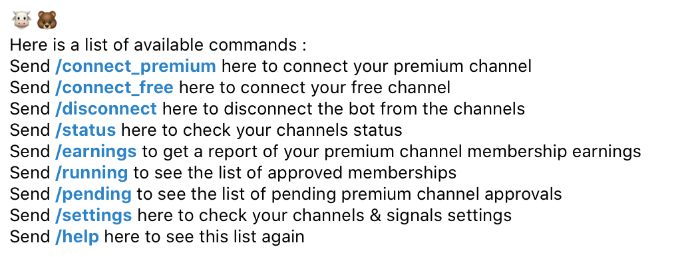

# Telegram Channels Manager Bot

## Description
A nodejs script to manage your telegram channels. It takes as model the [Trading signals channels] already available on telegram.
The script is able to:

- Link the free (samples) channel to the bot

  >         "free": {
  >             "password": 89258,
  >             "id": -1001647847809,
  >             "verified": true
  >         },

- Link the paid channel to the bot

  >         "paid": {
  >             "password": 343408,
  >             "id": -1001658217742,
  >             "verified": true
  >         }

- Send a message to the free channel based on 2 different templates Counter(a free signal once every N paid ones) and Timer (N free signals every M days) **under construction👷‍♂️**

- Users sends membership request to the bot:

  >                 {
  >                     "id": telegram_id,
  >                     "username": "telegram_username",
  >                     "name": "telegram_last_name",
  >                     "verified": false,
  >                     "package": "1",
  >                     "requestDate": 1664561469885
  >                 }

- Admins can accept or reject the membership request

  >                {
  >                     "id": telegram_id,
  >                     "username": "telegram_username",
  >                     "name": "telegram_last_name",
  >                     "verified": false,
  >                     "package": "1",
  >                     "validUntill": 1674554457429,
  >                     "validDate": 1664564457429,
  >                     "requestDate": 1664554457429
  >                }

- Admins can create a membership packages : **under construction👷‍♂️** (if you really want to test it paste the json below into the data.json file)

  >                 {
  >                     "package": "1",
  >                     "name": "1 Month",
  >                     "price": {
  >                     "amount": 100,
  >                     "currency": "USDT"
  >                     "duration": 30
  >                 }

- Added some reporting commands to get some resume of the activity 

## status

## earnings

## Installation
- Clone the repo
- Install the dependencies
> npm install
> node app.js

## Configuration
- Create a bot on telegram using the [BotFather](https://t.me/botfather)
- Add bot token to the $PATH or to .env file
- Create a free channel and a paid channel
- Add the bot to the free channel as admin
- Add the bot to the paid channel as admin
- Open the bot and send /start

## TODO
- [ ] Create a webhook for signals to be sent to the channels
- [ ] Add the telegram bot command for sending the signals
- [ ] Change JSON file to a database
- [ ] Finnish the **/settings_free** and **/settings_premium** commands
- [ ] Create a web interface to manage the bot
- [ ] Add some function for admin to be able to edit the messages and the placeholders 